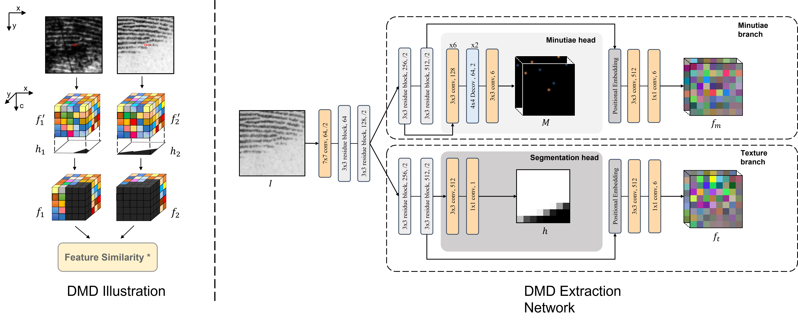

<p align="center">
  <h1 align="center">Latent Fingerprint Matching via Dense Minutia Descriptor</h1>
  <p align="center">
    <strong>Zhiyu Pan</strong>
    &nbsp;&nbsp;
    <strong>Yongjie Duan</strong>
    &nbsp;&nbsp;
    <a href="https://xiongjunguan.github.io/"><strong>Xiongjun Guan</strong></a>
    <br>
    <a href="http://ivg.au.tsinghua.edu.cn/~jfeng/"><strong>Jianjiang Feng*</strong></a>
    &nbsp;&nbsp;
    <strong>Jie Zhou</strong>
  </p>
  <br>
  <div align="center">
    
  </div>
  <p align="center">
    <a href="https://arxiv.org/abs/2405.01199"></a>
  </p>
  <br>
</p>

## 🔍 Overview

This repository contains the official implementation of our IJCB 2024 paper, **"Latent Fingerprint Matching via Dense Minutia Descriptor"**. The proposed method improves the accuracy and efficiency of latent fingerprint matching through a robust dense descriptor learned from fingerprint minutiae.

## 🗞️ News and Updates

- **[July 3, 2024]** Initial release of inference code.
    - Includes basic inference pipeline for DMD.
- **[May 21, 2025]** Codebase updated.
    - Added GPU-based score computation for significantly improved speed.

## ⚙️ Requirements

We recommend running the code on a Linux system with an NVIDIA GPU. Other configurations have not been fully tested.

**Dependencies:**
- `Python == 3.8`
- `torch == 1.10.1`
- `scikit-learn == 1.3.0`
- `scipy == 1.10.1`
- `numpy == 1.24.4`

Install the `torch_linear_assignment` library by compiling it from source as described in the [official repository](https://github.com/ivan-chai/torch-linear-assignment).

Download the `fptools` library to the root directory of this project:
```bash
git clone https://github.com/youngjetduan/fptools.git
````

## 📥 Download Pretrained Weights

Download the pretrained [model weights](https://cloud.tsinghua.edu.cn/f/fd5ca22af0eb44afa124/?dl=1) trained on NIST SD14 and place them under:

```
./logs/DMD/
```

## 📁 Prepare the Dataset

Organize your evaluation dataset in the following format:

```bash
TEST_DATA/
├── NIST27/                     # Replace with your custom dataset name
│   ├── image/                  # Folder for fingerprint images
│   │   ├── query/              # Query images (e.g., latent)
│   │   │   ├── xxxx.bmp
│   │   ├── gallery/            # Gallery images (e.g., reference prints)
│   │       ├── yyyy.bmp
│   │
│   ├── mnt/                    # Folder for minutiae files
│   │   ├── query/              # Minutiae files for query images
│   │   │   ├── xxxx.mnt        # Extracted by VeriFinger or similar tools
│   │   ├── gallery/            # Minutiae files for gallery images
│   │       ├── yyyy.mnt
│   │
│   ├── genuine_pair.txt        # (Optional) File listing genuine query-gallery pairs
```

### 📄 Format of `genuine_pair.txt`

Each line in `genuine_pair.txt` defines a genuine matching pair between a query and a gallery image. The file format is as follows:

```
query_filename, gallery_filename
xxxx, yyyy
zzzz, wwww
...
```

This file is used in evaluations where explicit genuine pairs are required (e.g., CMC or TAR\@FAR metrics). All remaining combinations are considered impostor pairs by default.

You can preprocess the dataset by running:

```bash
python dump_dataset_mnteval.py --prefix /path/to/dataset
```

## 📈 Evaluation

Run the evaluation script:

```bash
python evaluate_mnt.py -d $DatasetName
```

## 📄 License & Usage

This project is released under the **Apache 2.0 license**.
⚠️ **Note:** This code is intended for **academic research only** and **must not** be used for commercial purposes.

## 📚 Citation

If you find this repository helpful, please consider starring it and citing our paper:

```bibtex
@article{pan2024latent,
  title={Latent Fingerprint Matching via Dense Minutia Descriptor},
  author={Pan, Zhiyu and Duan, Yongjie and Guan, Xiongjun and Feng, Jianjiang and Zhou, Jie},
  journal={arXiv preprint arXiv:2405.01199},
  year={2024}
}
```
